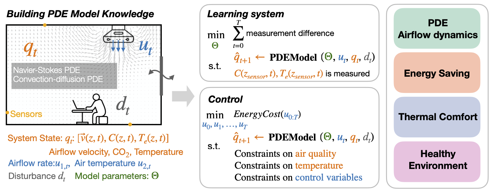

# PDE-HVAC-control

This repository contains the code and data to reproduce the results in our work: **Ventilation and Temperature Control for Energy-efficient and Healthy Buildings: A Differentiable PDE Approach**, which has been accepted by Applied Energy.  



# Installation  

You are required to install 
- phiflow https://github.com/tum-pbs/PhiFlow
- gymnasium 

# Learning for PDEs in smart buildings
```python
cd learning
python learn_real.py # for real experiment
python learn_synthetic.py # for synthetic experiment
```

# Controlling PDEs in smart buildings
```python
cd control
python train_diffpde.py # our approach
python train_rl.py # reinforcement learning 
```


# Citation 
If this is useful for your work, please cite our paper. 
